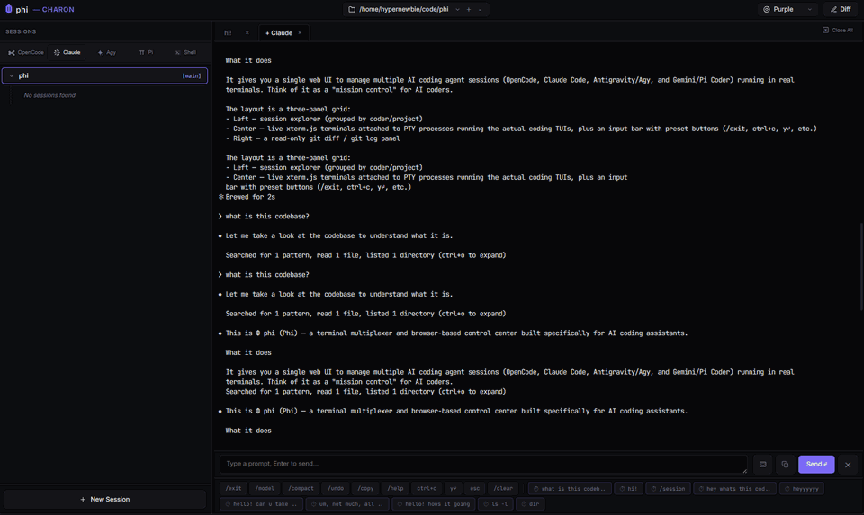

# Φ phi

**A terminal multiplexer and browser-based control center for AI coding assistants.**

Phi gives you a single web UI to run, monitor, and switch between multiple AI coding agents — [OpenCode](https://opencode.ai), [Claude Code](https://claude.com/claude-code), [Antigravity](https://antigravity.google) (Agy), and [Pi Coder](https://github.com/badlogic/pi-mono) — each running in a real PTY, alongside a live git diff of your work. Think of it as mission control for AI coders.



## Features

- **One UI, many agents** — spawn and tab between OpenCode, Claude Code, Antigravity, Pi Coder, and plain shell sessions, all in the browser.
- **Real terminals** — each session is a genuine PTY rendered with [xterm.js](https://xtermjs.org) (WebGL with canvas fallback), so the agent TUIs render exactly as they would in your terminal.
- **Session resume** — Phi reads each tool's on-disk history (OpenCode's SQLite DB, Claude Code's project JSONL, Antigravity's conversation files, Pi's session files) and lets you reattach to a past conversation with one click.
- **Detach & survive** — closing a browser tab detaches the PTY but keeps the process alive for a 30-minute grace period. Reopen the session to reattach to the still-running agent.
- **Live git diff** — a read-only side panel streams `git diff` and `git log` for the active workspace so you can watch the agent's changes land.
- **Git worktree aware** — browse and switch between git worktrees per workspace.
- **Quick-action presets** — one-tap buttons for common agent commands (`/exit`, `/model`, `/compact`, `ctrl+c`, `y↵`, `esc`, …), plus a staged input bar for composing longer prompts.
- **Multiple workspaces & themes** — register several project directories and pick a UI accent color.

## Architecture

Phi is a single Go binary serving a vanilla-JS frontend (no build step, no framework).

```
phi/
├── main.go                 HTTP server, API routes, static file server, config
├── pkg/
│   ├── pty/                PTY spawning, process registry, 30-min detach timer
│   ├── session/            Per-tool session parsers (opencode/claude/agy/pi) + worktrees
│   ├── ws/                 Binary WebSocket hub + PTY⇄browser I/O bridge
│   ├── diff/               git diff / git log streamers
│   └── coders/             Command definitions & preset buttons per assistant
└── web/                    index.html, *.js (xterm.js client), style.css, vendor/
```

**WebSocket protocol** (binary, type-prefixed frames):

| Prefix | Client → Server | Server → Client |
| ------ | --------------- | --------------- |
| `0x01` | stdin bytes → PTY | PTY output → xterm.js |
| `0x02` | resize `{cols, rows}` | control / metadata JSON |
| `0x03` | ping | pong |

See [`PLAN.md`](PLAN.md) for the full design notes and locked decisions.

## Quickstart

```bash
go install github.com/hypernewbie/phi@latest
cd ~/code/my-project
phi
```

Then open <http://localhost:7070>. The web UI is embedded in the binary, so it works from any directory.

## Getting started

### Prerequisites

- Go 1.26+
- Whichever agent CLIs you want to drive, on your `PATH`: `opencode`, `claude`, `agy`, `pi`
- `git` (for the diff/log panels)

### Build from source

```bash
git clone https://github.com/hypernewbie/phi.git
cd phi
go build -o phi .
```

Then run `./phi` from any project directory (or move the binary onto your `PATH`) and open <http://localhost:7070>.

The directory you launch Phi from becomes the default workspace; switch between projects from the workspace picker in the UI and add more with the **+** button.

### Flags

| Flag    | Default | Description             |
| ------- | ------- | ----------------------- |
| `-port` | `7070`  | Port for the web server |

> **Note:** Phi binds to `0.0.0.0` and has no authentication. Only run it on a trusted network (or behind a reverse proxy / SSH tunnel).

## Configuration

State is stored in `~/.phi/`:

- `config.json` — registered workspaces, theme color, and per-workspace worktree state.
- `sessions.json` — local names/timestamps for Antigravity sessions (its conversation files are binary, so Phi keeps a sidecar map).

Both are created automatically.

## Supported assistants

| ID         | Name         | Command    | Session source                                   |
| ---------- | ------------ | ---------- | ------------------------------------------------ |
| `opencode` | OpenCode     | `opencode` | `~/.local/share/opencode/opencode.db` (SQLite)   |
| `claude`   | Claude Code  | `claude`   | `~/.claude/projects/` (JSONL)                    |
| `agy`      | Antigravity  | `agy`      | `~/.gemini/antigravity-cli/conversations/` (`.pb`)|
| `pi`       | Pi Coder     | `pi`       | Pi session files                                 |
| `bash`     | Shell        | `bash -l` | —                                                |
