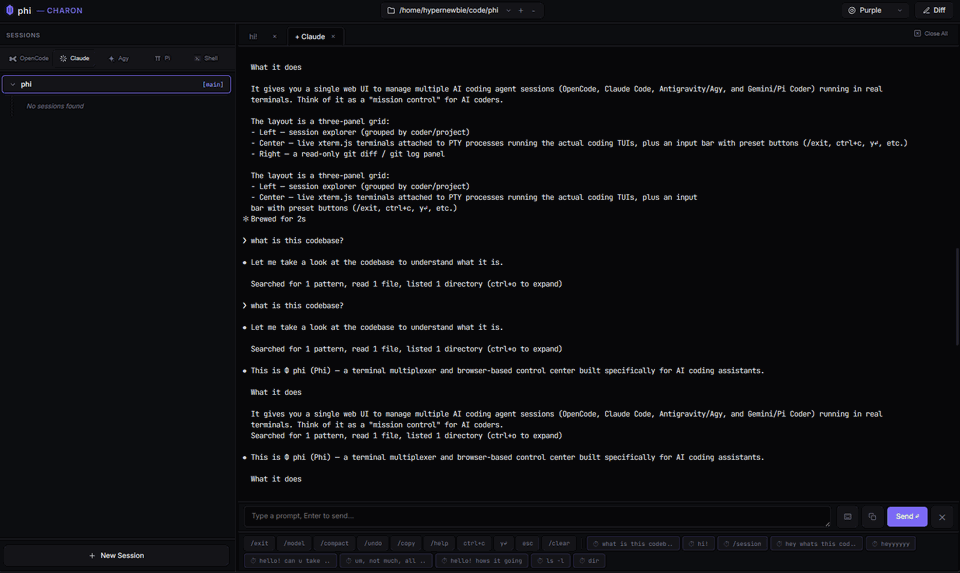

# Φ phi

**A terminal multiplexer and browser-based control center for AI coding assistants.**

Phi gives you a single web UI to run, monitor, and switch between multiple AI coding agents — [OpenCode](https://opencode.ai), [Claude Code](https://claude.com/claude-code), [Antigravity](https://antigravity.google) (Agy), and [Pi Coder](https://github.com/badlogic/pi-mono) — each running in a real PTY, alongside a live git diff of your work. Think of it as mission control for AI coders.



## Features

- **One UI, many agents** — spawn and tab between OpenCode, Claude Code, Antigravity, Pi Coder, and plain shell sessions, all in the browser.
- **Real terminals** — each session is a genuine PTY rendered with [xterm.js](https://xtermjs.org) (WebGL with canvas fallback), so the agent TUIs render exactly as they would in your terminal.
- **Session resume** — Phi reads each tool's on-disk history (OpenCode's SQLite DB, Claude Code's project JSONL, Antigravity's conversation files, Pi's session files) and lets you reattach to a past conversation with one click.
- **Detach & survive** — closing a browser tab detaches the PTY but keeps the process alive for a 30-minute grace period. Reopen the session to reattach to the still-running agent.
- **Live git diff** — a read-only side panel streams `git diff` and `git log` for the active workspace so you can watch the agent's changes land.
- **Git worktree aware** — browse and switch between git worktrees per workspace.
- **Quick-action presets** — one-tap buttons for common agent commands (`/exit`, `/model`, `/compact`, `ctrl+c`, `y↵`, `esc`, …), plus a staged input bar for composing longer prompts.
- **Multiple workspaces & themes** — register several project directories and pick a UI accent color.
- **Optional desktop pet** — an animated companion overlay for the Electron shell (`desktop/pet/`), ported from [dsh-pet](https://github.com/PC2005-cloud/dsh-pet).
- **Optional access password** — set it from **Config** to gate Phi's APIs and terminal WebSockets; trusted browsers stay unlocked without repeated prompts.
- **Vikunja Kanban Board** — a drag-and-drop Kanban dashboard (using SortableJS) embedded as a custom tab type, synced directly to your local Vikunja REST API via a backend HTTP proxy.

## Architecture

Phi is a single Go binary serving a vanilla-JS frontend (no build step, no framework).

```
phi/
├── main.go                 HTTP server, API routes, static file server, config
├── pkg/
│   ├── pty/                PTY spawning, process registry, 30-min detach timer
│   ├── session/            Per-tool session parsers (opencode/claude/agy/pi) + worktrees
│   ├── ws/                 Binary WebSocket hub + PTY⇄browser I/O bridge
│   ├── diff/               git diff / git log streamers
│   └── coders/             Command definitions & preset buttons per assistant
└── web/                    index.html, *.js (xterm.js client), style.css, vendor/
```

**WebSocket protocol** (binary, type-prefixed frames):

| Prefix | Client → Server | Server → Client |
| ------ | --------------- | --------------- |
| `0x01` | stdin bytes → PTY | PTY output → xterm.js |
| `0x02` | resize `{cols, rows}` | control / metadata JSON |
| `0x03` | ping | pong |
| `0x07` | — | `md-changed` push `{"dir"}` (fsnotify: a watched markdown dir changed) |

See [`PLAN.md`](PLAN.md) for the full design notes and locked decisions.

## Installation & Quickstart

### Method 1: Using NPM (Easiest, Cross-Platform)

Phi is distributed as the `@hypernewbie/phi-code` package on NPM. The installer automatically downloads the correct precompiled binary for your operating system (macOS, Linux, or Windows) and architecture (arm64 or amd64).

```bash
# Install globally
npm install -g @hypernewbie/phi-code

# Launch in your project directory
cd ~/code/my-project
phi
```

### Method 2: Using Go Install

If you have Go 1.26+ installed:

```bash
go install github.com/hypernewbie/phi@latest
cd ~/code/my-project
phi
```

After launching, open <http://localhost:7070> in your browser. The web UI is fully embedded, so you can run it from any directory.

## Getting started

### Prerequisites

- Go 1.26+
- Whichever agent CLIs you want to drive, on your `PATH`: `opencode`, `claude`, `agy`, `pi`
- `git` (for the diff/log panels)

### Build from source

```bash
git clone https://github.com/hypernewbie/phi.git
cd phi
go build -o phi .
```

Then run `./phi` from any project directory (or move the binary onto your `PATH`) and open <http://localhost:7070>.

The directory you launch Phi from becomes the default workspace; switch between projects from the workspace picker in the UI and add more with the **+** button.

### Frontend dev (live reload)

- Terminal 1: `./phi` (backend, :7070)
- Terminal 2: `pnpm run dev` → open <http://localhost:5173>
- If editing `web-src/*.ts`, also run `pnpm run watch:web` (tsc rewrites `web/*.js`; Vite reloads on the output).
- If phi runs on a non-default port, set the env var for both: `PHI_PORT=8080 ./phi` + `PHI_PORT=8080 pnpm run dev` (the flag `-port` alone won't retarget the proxy).
- Note: :5173 is dev-only; :7070 always serves the embedded (build-time) UI; prod is unchanged.

**Enable the pre-commit hook** (once per clone) so frontend checks run before you commit:

```bash
git config core.hooksPath .githooks
```

The hook (`.githooks/pre-commit`) only acts on commits that touch frontend files: it syntax-checks staged `web/*.js`, and when `*.ts` sources change it runs `typecheck` + `build:web` and blocks if the emitted `web/` tree drifts from `web-src/` (stage the rebuilt files and recommit). It's advisory — bypass with `git commit --no-verify`; CI (`.github/workflows/test.yml`) is the enforced backstop.

### Flags

| Flag              | Default | Description                                                                                                                        |
| ----------------- | ------- | ------------------------------------------------------------------------------------------------------------------------------------ |
| `-port`           | `7070`  | Port for the web server                                                                                                            |
| `-ip`             | `lan`   | Bind target. `lan` binds loopback plus every RFC 1918 LAN and Tailscale interface; use `127.0.0.1` for local-only access, `0.0.0.0` for every interface, or an explicit address. |
| `-log-level`      | `info`  | Log level: `debug`\|`info`\|`warn`\|`error` (or `PHI_LOG` env var). `debug` also enables WS/PTY frame traces and span timing lines. |
| `-otel-endpoint`  | (none)  | OTLP/gRPC collector endpoint (`host:port`) for OpenTelemetry export (or `PHI_OTEL_ENDPOINT` env var). Only takes effect in a binary built with `-tags otel` — the default build parses and ignores it, adding zero OTel dependencies. |

> **Network access:** By default Phi is available on localhost, private LAN, and Tailscale addresses—not public interfaces. Phi does not add authentication, so use `-ip 127.0.0.1` for local-only access and do not use `-ip 0.0.0.0` unless you deliberately want to expose it on every interface.

## Configuration

State is stored in `~/.phi/`:

- `config.json` — registered workspaces, theme color, and per-workspace worktree state.
- `sessions.json` — local names/timestamps for Antigravity sessions (its conversation files are binary, so Phi keeps a sidecar map).

Both are created automatically. `config.json` also holds an optional browser-derived access-password verifier; an empty value disables access protection. Set or clear it from **Config** rather than editing it by hand. Phi's access password protects casual LAN/Tailnet access, but HTTPS is still required against an active hostile-network attacker.

## Supported assistants

| ID         | Name         | Command    | Session source                                   |
| ---------- | ------------ | ---------- | ------------------------------------------------ |
| `opencode` | OpenCode     | `opencode` | `~/.local/share/opencode/opencode.db` (SQLite)   |
| `claude`   | Claude Code  | `claude`   | `~/.claude/projects/` (JSONL)                    |
| `agy`      | Antigravity  | `agy`      | `~/.gemini/antigravity-cli/conversations/` (`.pb`)|
| `pi`       | Pi Coder     | `pi`       | Pi session files                                 |
| `bash`     | Shell        | `bash -l` | —                                                |

## Acknowledgments

- **Desktop pet overlay** — the optional animated pet companion bundled with the Electron shell (`desktop/pet/`) is a port of [dsh-pet](https://github.com/PC2005-cloud/dsh-pet) by [PC2005-cloud](https://github.com/PC2005-cloud). Used under the MIT License; see [`desktop/pet/LICENSE-dsh-pet.txt`](desktop/pet/LICENSE-dsh-pet.txt).
